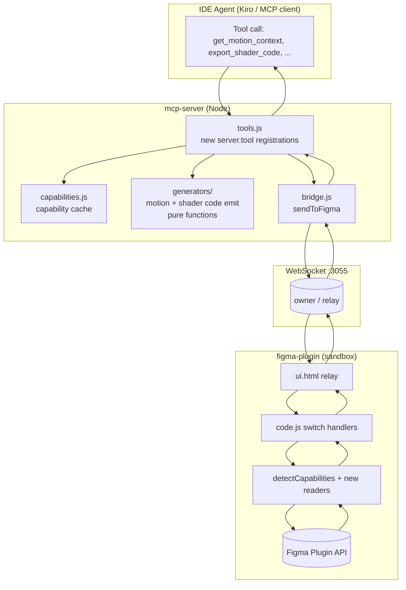
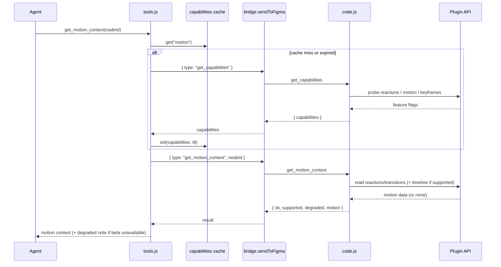
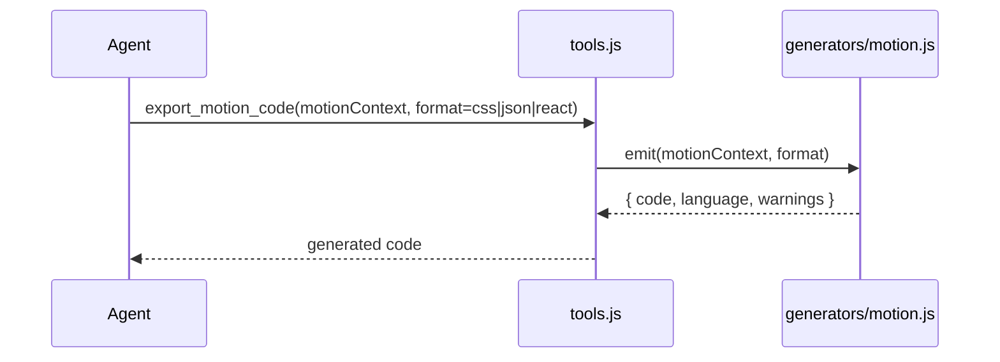

# Design Document: config-2026-tools

## Overview

This feature expands the **Figma Local MCP** (this repository) with a new family of MCP tools and matching Figma plugin handlers that extract context for — and assist with — the materials introduced at **Figma Config 2026** (announced June 24, 2026): **Motion** (timeline/keyframe animation), **Code layers** (code-backed, two-way-synced canvas layers), **Shader fills and effects**, **Generative plugins**, **Weave** (node-based generative visual workflows), **agent skills/connectors/attachments** (context packaging), and the **GA of Slots** in the Plugin API.

The expansion is **additive** and follows the repository's existing architecture exactly: every capability is a new MCP tool registered in `mcp-server/src/tools.js` that forwards a typed command through `bridge.sendToFigma(...)`, is handled by a new `case` in the Figma plugin's `figma.ui.onmessage` switch in `figma-plugin/code.js`, and reads/writes through the Figma Plugin API. No existing tools are removed or renamed.

Because several Config 2026 surfaces ship behind Figma beta/waitlist flags and are **not yet guaranteed in the public Plugin API**, the central design principle is **runtime feature detection with graceful degradation**. A new `get_capabilities` tool probes the live Plugin API, and every new handler returns a uniform `{ ok, supported, degraded, reason, ... }` envelope so an agent can decide whether to use a dedicated tool or fall back to the existing `use_figma` escape hatch. The MCP server never assumes a beta API exists; the plugin sandbox is the single place that touches `figma.*`.

**The guidance layer is a first-class deliverable, not an afterthought.** Structured tool output is only useful when an agent knows *when* to call each tool and *how* to chain them. This repository already proves the pattern: the thin `create_design_system_rules` tool is paired with a rich `skills/figma-create-design-system-rules/SKILL.md` workflow doc, and steering files under `powers/local-figma/steering/`. Accordingly, **every new tool ships with a companion skill/steering doc**, and the server additionally exposes its guidance over the MCP `prompts`/`resources` capabilities (the same protocol surfaces Figma's official server uses), so guidance travels over the wire and not only as files.

To keep tool names, descriptions, and guidance aligned with whatever Figma ships next, the design includes an **optional capture/proxy dev mode** that sits in front of Figma's official Dev Mode MCP server and logs its `tools/list`, `prompts/list`, and `resources/list` responses. This is benign, on-machine inspection of a server the user is authorized to use. Captured text is used to *align structure and naming*; companion guidance is authored (paraphrased) rather than copied verbatim, with a compliance note recorded wherever captured material informs a skill. **Figma's hosted canvas-agent system prompt is explicitly out of scope**: it lives server-side in Figma's infrastructure, never crosses the wire to this MCP, and must not be targeted by extraction/jailbreak attempts.

---

# Part A — High-Level Design (Diagrams & Interfaces)

## Architecture

The new tools slot into the existing request path without changing the transport. The MCP server stays "dumb" about Figma internals; all `figma.*` access is isolated in the plugin sandbox, and pure transforms (code generation, bundling) run server-side where possible.



**Key architectural decisions:**

- **Plugin-only Figma access.** Every new beta surface is read inside `code.js` behind capability checks. The MCP server never references `figma.*`.
- **Server-side pure transforms.** Motion-to-code and shader-to-code emission are deterministic transforms over already-extracted context. They live in new `mcp-server/src/generators/` modules so they are unit-testable in Node without a live Figma connection, mirroring how `content.js` and `code-connect-store.js` are tested today.
- **Uniform capability envelope.** All new plugin handlers return `{ ok, supported, degraded, reason }` plus payload, so degradation is a first-class, inspectable state rather than an error.
- **One probe, cached.** `get_capabilities` runs the detection once per session (cached in the server with a short TTL) and other tools may consult the cache to choose strategy.

## Sequence Diagrams

### Capability-gated context read (motion example)



### Code emission (no Figma round-trip after read)



## Components and Interfaces

### Component 1: Capability Probe (`get_capabilities`)

**Purpose**: Detect which Config 2026 Plugin API surfaces exist in the connected Figma Desktop build, so tools can choose dedicated paths or graceful fallbacks.

**Interface** (MCP tool):
```
get_capabilities(refresh?: boolean) -> CapabilityReport
```

**Responsibilities**:
- Probe the live Plugin API for motion/timeline, code layers, shaders, weave, and slot APIs.
- Return a structured, versioned report; never throw on a missing beta API.
- Be cached server-side with a TTL and a `refresh` override.

### Component 2: Motion tools (`get_motion_context`, `export_motion_code`)

**Purpose**: Inspect animation/motion on a node and emit CSS / JSON / React.

**Interface**:
```
get_motion_context(nodeId?, includeReactions?) -> MotionContext
export_motion_code(motion: MotionContext, format: "css"|"json"|"react", options?) -> GeneratedCode
```

**Responsibilities**:
- Extract Motion timeline/keyframes when available; otherwise fall back to prototype `reactions` (smart-animate transitions + easing) and report `degraded`.
- Emit deterministic, framework-appropriate code from extracted context (server-side, pure).

### Component 3: Code-layer tools (`get_code_layer_context`, `sync_code_layer`)

**Purpose**: Read code-backed canvas layers and assist two-way sync.

**Interface**:
```
get_code_layer_context(nodeId?) -> CodeLayerContext
sync_code_layer(nodeId, direction: "toDesign"|"toCode", payload?) -> SyncResult
```

**Responsibilities**:
- Read the code layer's source, props/inputs, and sync status when the API exists.
- Fall back to reading `pluginData`/`sharedPluginData` metadata and node structure; report `degraded` and never mutate destructively without explicit `direction`.

### Component 4: Shader tools (`get_shader_context`, `export_shader_code`)

**Purpose**: Read parameterized shader fills/effects and emit shader/CSS code.

**Interface**:
```
get_shader_context(nodeId?) -> ShaderContext
export_shader_code(shader: ShaderContext, target: "glsl"|"wgsl"|"css", options?) -> GeneratedCode
```

**Responsibilities**:
- Surface shader paint/effect parameters (uniforms, source, presets) including unknown paint/effect types as raw params.
- Emit shader code from parameters (server-side, pure).

### Component 5: Slot tools (`get_slot_context`, `set_slot_content`)

**Purpose**: Inspect and fill component Slots (GA at Config 2026).

**Interface**:
```
get_slot_context(nodeId?) -> SlotContext
set_slot_content(slotNodeId, content: SlotContentSpec) -> MutationResult
```

**Responsibilities**:
- Detect slot definitions on components/instances and report accepted content types.
- Fill a slot using the slot API when present, else fall back to `INSTANCE_SWAP`/child manipulation.

### Component 6: Weave tools (`get_weave_context`)

**Purpose**: Read node-based generative ("Weave") graphs when present.

**Interface**:
```
get_weave_context(nodeId?) -> WeaveContext
```

**Responsibilities**:
- Read Weave graph nodes/edges/parameters when the API exists; else fall back to section/connector structure and report `degraded`.

### Component 7: Context packaging (`package_context_bundle`)

**Purpose**: Assemble a single agent-ready attachment bundle (skills/connectors/attachments theme).

**Interface**:
```
package_context_bundle(nodeId?, include: BundleParts[]) -> ContextBundle
```

**Responsibilities**:
- Orchestrate existing + new readers (metadata, screenshot, variables, motion, shader, slots, code-connect) into one normalized payload, honoring capability flags.

### Component 8: Generative tool scaffolding (`scaffold_generative_tool`)

**Purpose**: Turn a natural-language tool description (behavior, controls, parameters) into a ready-to-paste `use_figma` script and/or a new-tool spec.

**Interface**:
```
scaffold_generative_tool(spec: GenerativeToolSpec) -> ScaffoldResult
```

**Responsibilities**:
- Validate the spec and emit a parameterized `use_figma` script plus a JSON descriptor; this is generation only (no dynamic server mutation of the tool registry by default).

### Component 9: Guidance layer (skills, steering, and MCP prompts/resources)

**Purpose**: Make every new tool reliably discoverable and correctly chained by an agent, mirroring the repo's existing `SKILL.md` + steering pattern, and ship that guidance over the protocol — not only as files.

**Interface** (MCP capabilities + filesystem deliverables):
```
// Filesystem (authored docs)
skills/figma-motion/SKILL.md
skills/figma-code-layers/SKILL.md
skills/figma-shaders/SKILL.md
skills/figma-slots/SKILL.md
powers/local-figma/steering/config-2026.md
// Protocol (served by mcp-server)
prompts/list, prompts/get          // expose skill workflows as MCP prompts
resources/list, resources/read     // expose steering/reference docs as MCP resources
```

**Responsibilities**:
- For each new tool, author a companion skill doc covering *when to call*, *call order*, *how to chain* with existing tools (`get_design_context`, `get_screenshot`), and degraded-path handling.
- Register an MCP `prompts` provider that surfaces these workflows and a `resources` provider that surfaces steering/reference docs, loaded from disk at startup.
- Keep authored guidance paraphrased; never embed Figma proprietary prompt text verbatim. Record a compliance note where captured material informed a doc.

### Component 10: Official-MCP capture/proxy dev mode (`--proxy`)

**Purpose**: An optional, developer-only mode to align this server's tool names, descriptions, and guidance with Figma's official MCP server by inspecting its protocol surfaces.

**Interface** (CLI/env, dev-only — off by default):
```
node server.js --proxy --upstream=<figma-official-mcp-url>   // or FIGMA_MCP_UPSTREAM env
// Captures upstream tools/list, prompts/list, resources/list -> writes .figma-mcp/capture/*.json
```

**Responsibilities**:
- Connect as an MCP **client** to Figma's official Dev Mode/remote MCP server (a server the user is already authorized to use) and enumerate `tools/list`, `prompts/list`, `resources/list`.
- Persist the raw responses under `.figma-mcp/capture/` for human review and naming alignment.
- Never auto-rewrite this server's tools or copy text into shipped artifacts; capture is read-only inspection. Out of scope: the hosted canvas-agent system prompt (not exposed over MCP).

## Data Models

### CapabilityReport
```
CapabilityReport {
  source: "local-plugin"
  apiVersion: string | null          // figma.apiVersion if present
  editorType: "figma" | "figjam" | "dev" | "slides" | string
  capabilities: {
    motion: { reactions: boolean, timeline: boolean, keyframes: boolean }
    codeLayers: { read: boolean, sync: boolean }
    shaders: { fills: boolean, effects: boolean }
    slots: { read: boolean, write: boolean }
    weave: { read: boolean }
  }
  probedAt: number                    // epoch ms
}
```

### MotionContext
```
MotionContext {
  nodeId: string
  supported: boolean
  degraded: boolean                   // true when derived from reactions, not the Motion timeline
  source: "timeline" | "reactions" | "none"
  durationMs: number | null
  tracks: MotionTrack[]               // [] when degraded/none
  reactions: ReactionSummary[]        // fallback prototype interactions
  warnings: string[]
}
MotionTrack { property: string, keyframes: Keyframe[] }
Keyframe { timeMs: number, value: number | string | object, easing: EasingSpec }
EasingSpec { type: string, cubicBezier?: [number,number,number,number] }
ReactionSummary { trigger: string, action: string, transition: EasingSpec | null, durationMs: number | null, destinationId: string | null }
```
**Validation rules**: `timeMs >= 0`; keyframes sorted ascending by `timeMs`; `durationMs >= max(keyframe.timeMs)` when tracks present.

### ShaderContext
```
ShaderContext {
  nodeId: string
  supported: boolean
  degraded: boolean
  fills: ShaderParam[]                // shader-type paints
  effects: ShaderParam[]              // shader-type effects
  unknownPaintTypes: string[]         // surfaced for forward-compat
}
ShaderParam { kind: "fill"|"effect", type: string, uniforms: object, source?: string, preset?: string }
```

### CodeLayerContext
```
CodeLayerContext {
  nodeId: string
  supported: boolean
  degraded: boolean
  language: string | null
  source: string | null
  inputs: object | null               // bound props/parameters
  syncState: "inSync"|"codeAhead"|"designAhead"|"unknown"
  metadataSource: "api"|"pluginData"
}
```

### SlotContext
```
SlotContext {
  nodeId: string
  supported: boolean
  slots: SlotDef[]
}
SlotDef { slotNodeId: string, name: string, acceptedTypes: string[], currentContentId: string | null }
```

### GeneratedCode
```
GeneratedCode { language: string, code: string, format: string, warnings: string[] }
```

### GenerativeToolSpec / ScaffoldResult
```
GenerativeToolSpec {
  name: string
  description: string
  parameters: { name: string, type: "string"|"number"|"boolean"|"color"|"enum", required?: boolean, enum?: string[], default?: any }[]
  behavior: string                    // natural-language description of canvas effect
}
ScaffoldResult { useFigmaScript: string, descriptor: object, warnings: string[] }
```

### ContextBundle
```
ContextBundle {
  nodeId: string
  parts: { metadata?, screenshot?, variables?, motion?, shader?, slots?, codeConnect? }
  capabilities: CapabilityReport
  generatedAt: number
}
```

## Error Handling

### Scenario 1: Beta API not present in connected build
**Condition**: A Config 2026 surface (e.g., Motion timeline) is unavailable in the live Plugin API.
**Response**: Handler returns `{ ok: true, supported: false, degraded: true, reason }` with best-effort fallback data (e.g., `reactions`).
**Recovery**: Agent reads `degraded`/`reason` and either uses the fallback data or switches to `use_figma`.

### Scenario 2: Figma plugin not connected
**Condition**: `figmaSocket` is null/closed.
**Response**: `bridge.sendToFigma` rejects with the existing "Figma plugin is not connected" message; the tool returns `textContent("Error: ...")`, matching current tools.
**Recovery**: User starts the bridge plugin; no special handling added.

### Scenario 3: Node not found / wrong editor type
**Condition**: `nodeId` does not resolve, or a design-only feature is requested in FigJam.
**Response**: `{ ok: false, error }` from the plugin (reuses `getTargetNodes` which throws on missing node).
**Recovery**: Agent re-selects or queries `get_capabilities` for `editorType`.

### Scenario 4: Code generation given malformed/partial context
**Condition**: `export_*_code` receives context with missing fields.
**Response**: Generator emits best-effort code and appends `warnings[]`; never throws on recoverable gaps.
**Recovery**: Agent inspects `warnings` and refines input.

### Scenario 5: Destructive slot/code-layer write
**Condition**: `set_slot_content` / `sync_code_layer` would overwrite content.
**Response**: Requires explicit `direction`/`content`; reuses the plugin's pre-flight validation pattern. Writes return `mutatedNodeIds` for follow-up.
**Recovery**: Agent can re-read context before/after.

## Testing Strategy

### Unit Testing
- Pure generators (`generators/motion.js`, `generators/shader.js`) and the capability-cache logic are tested in Node with the existing `node --test` setup (see `mcp-server/test/`). Inputs are fixture `MotionContext`/`ShaderContext` objects; outputs are asserted against expected CSS/JSON/React/GLSL strings and `warnings`.
- Bundle assembly is tested with a mocked `sendToFigma` to verify capability-gated inclusion.

### Property-Based Testing
- **Library**: `fast-check` (Node, matches the JS toolchain).
- Properties over the motion code generator and capability normalizer (see Correctness Properties). Plugin-side `figma.*` code is not property-tested (no headless Plugin API); it is covered by manual smoke tests and capability fallbacks.

### Integration Testing
- Manual smoke test against Figma Desktop with the bridge running: select a node, call `get_capabilities`, then each context tool, verifying the `{ supported, degraded }` envelope on both supporting and non-supporting builds.

## Performance Considerations

- `get_capabilities` is cached server-side (TTL, default 60s) to avoid a round-trip on every motion/shader call.
- Context readers reuse the existing `flattenNodes` traversal and bounded summaries (caps like the current `slice(0, N)`) to avoid huge payloads on large selections.
- Code generation is pure/local (no Figma round-trip).

## Security Considerations

- No new network exposure: the same `ws://localhost:3055` bridge is used; no new ports or endpoints.
- `scaffold_generative_tool` only emits text (a script + descriptor); it does **not** auto-execute. Execution still goes through the existing `use_figma` path with its pre-flight validation.
- Code-layer/shader source is treated as untrusted content and is never `eval`'d by the server; it is returned as data.
- **Capture/proxy mode is dev-only and off by default.** It acts purely as an MCP client to a server the user already controls, writes captures to a gitignored `.figma-mcp/capture/` path, and makes no outbound transmission of project code. It must not be enabled in normal runtime.

### Compliance boundary

- Authored skills/steering paraphrase intent and structure; Figma proprietary prompt text is **not** reproduced verbatim in shipped artifacts. A short compliance note is added wherever captured material informed a doc.
- Figma's hosted canvas-agent system prompt is **out of scope** — it is never transmitted over MCP and is not a target for extraction.

## Dependencies

- Existing: `@modelcontextprotocol/sdk`, `ws`, `zod` (already in `mcp-server/package.json`).
- New (dev only): `fast-check` for property-based tests.
- Capture/proxy mode reuses the MCP **client** classes already shipped in `@modelcontextprotocol/sdk` (no new runtime dependency).
- Runtime feature dependency: Figma Desktop build exposing Config 2026 Plugin APIs (optional; degraded paths cover absence).

---

# Part B — Low-Level Design (Code-First)

All code is **JavaScript**, matching the existing repository (`mcp-server/src/tools.js`, `figma-plugin/code.js`, ES modules in the server, sandbox JS in the plugin). Types are expressed with JSDoc typedefs since the repo is plain JS.

## Core Interfaces / Types (JSDoc)

```js
/**
 * @typedef {Object} CapabilityReport
 * @property {"local-plugin"} source
 * @property {string|null} apiVersion
 * @property {string} editorType
 * @property {{motion:{reactions:boolean,timeline:boolean,keyframes:boolean},
 *             codeLayers:{read:boolean,sync:boolean},
 *             shaders:{fills:boolean,effects:boolean},
 *             slots:{read:boolean,write:boolean},
 *             weave:{read:boolean}}} capabilities
 * @property {number} probedAt
 */

/**
 * @typedef {Object} MotionContext
 * @property {string} nodeId
 * @property {boolean} supported
 * @property {boolean} degraded
 * @property {"timeline"|"reactions"|"none"} source
 * @property {number|null} durationMs
 * @property {Array<{property:string, keyframes:Array<{timeMs:number,value:*,easing:object}>}>} tracks
 * @property {Array<object>} reactions
 * @property {string[]} warnings
 */

/** @typedef {{language:string, code:string, format:string, warnings:string[]}} GeneratedCode */
```

## Key Functions with Formal Specifications

### `detectCapabilities()` — plugin sandbox (`figma-plugin/code.js`)

```js
// Returns a CapabilityReport.capabilities object by probing the live Plugin API.
function detectCapabilities()
```
**Preconditions**: Runs inside the Figma plugin sandbox (`figma` global available).
**Postconditions**:
- Returns an object whose every leaf is a strict boolean (never `undefined`).
- Never throws: each probe is wrapped so a missing/throwing API yields `false`.
- Pure read: performs no mutation of the document.

### `getMotionContext(node, capabilities)` — plugin sandbox

```js
// Extracts MotionContext for a single node.
async function getMotionContext(node, capabilities)
```
**Preconditions**: `node` is a resolved node; `capabilities` is the report from `detectCapabilities()`.
**Postconditions**:
- If `capabilities.motion.timeline` → `source === "timeline"`, `degraded === false`, `tracks` populated.
- Else if `node.reactions` exists → `source === "reactions"`, `degraded === true`, `tracks === []`, `reactions` populated.
- Else → `source === "none"`, `supported === false`, `tracks === []`.
- `tracks[*].keyframes` are sorted ascending by `timeMs`; all `timeMs >= 0`.

### `emitMotionCode(motion, format, options)` — server (`mcp-server/src/generators/motion.js`)

```js
// Pure transform: MotionContext -> GeneratedCode. No Figma access.
export function emitMotionCode(motion, format = "css", options = {})
```
**Preconditions**: `motion` is a MotionContext-shaped object; `format ∈ {"css","json","react"}`.
**Postconditions**:
- Returns `{ language, code, format, warnings }`; `language` matches `format` (`css`→"css", `json`→"json", `react`→"tsx").
- Deterministic: equal inputs produce byte-identical `code`.
- If `motion.tracks` is empty → `code` is a valid empty/no-op artifact and `warnings` includes a "no keyframes" note.
- Never throws for any MotionContext-shaped input (missing optional fields tolerated).

### `normalizeCapabilities(raw)` — server (`mcp-server/src/capabilities.js`)

```js
// Fills missing leaves with false and stamps probedAt; idempotent.
export function normalizeCapabilities(raw)
```
**Preconditions**: `raw` is an object or null/undefined.
**Postconditions**: Output schema is fully populated with booleans; `normalizeCapabilities(normalizeCapabilities(x))` deep-equals `normalizeCapabilities(x)` (idempotent except `probedAt`).

## Algorithmic Pseudocode

### Motion extraction with graceful degradation (plugin)

```pascal
ALGORITHM getMotionContext(node, capabilities)
INPUT: node, capabilities
OUTPUT: motion of type MotionContext
BEGIN
  ctx ← { nodeId: node.id, supported: false, degraded: false,
          source: "none", durationMs: null, tracks: [], reactions: [], warnings: [] }

  // Preferred path: Config 2026 Motion timeline (beta, feature-detected)
  IF capabilities.motion.timeline AND "motion" IN node THEN
    ASSERT node.motion ≠ null
    tracks ← readTimelineTracks(node.motion)         // sort keyframes by timeMs
    FOR each t IN tracks DO
      ASSERT isSortedAscending(t.keyframes, "timeMs")
    END FOR
    ctx.supported ← true
    ctx.source ← "timeline"
    ctx.tracks ← tracks
    ctx.durationMs ← maxKeyframeTime(tracks)
    RETURN ctx
  END IF

  // Fallback path: prototype reactions (smart-animate transitions + easing)
  IF "reactions" IN node AND node.reactions.length > 0 THEN
    ctx.supported ← true
    ctx.degraded ← true
    ctx.source ← "reactions"
    ctx.reactions ← summarizeReactions(node.reactions)
    ctx.warnings.push("Motion timeline API unavailable; derived from prototype reactions.")
    RETURN ctx
  END IF

  // Nothing available
  ctx.warnings.push("No motion or prototype data on node.")
  RETURN ctx
END
```
**Loop invariant**: for every processed track `t`, `t.keyframes` is sorted ascending by `timeMs` and all times are `≥ 0`.

### Deterministic CSS emission (server)

```pascal
ALGORITHM emitMotionCss(motion)
INPUT: motion (MotionContext)
OUTPUT: GeneratedCode
BEGIN
  warnings ← []
  IF motion.tracks.length = 0 THEN
    warnings.push("No keyframes; emitting empty animation.")
    RETURN { language: "css", format: "css", code: "/* no motion */", warnings }
  END IF

  name ← "anim-" + sanitize(motion.nodeId)
  dur  ← (motion.durationMs OR 0) / 1000
  body ← ""
  FOR each track IN motion.tracks DO
    FOR each kf IN track.keyframes DO              // already sorted
      pct ← (motion.durationMs > 0) ? round(100 * kf.timeMs / motion.durationMs) : 0
      body ← body + pct + "% { " + cssProp(track.property, kf.value) +
                    "; animation-timing-function: " + cssEasing(kf.easing) + "; }\n"
    END FOR
  END FOR
  code ← "@keyframes " + name + " {\n" + body + "}\n" +
         ".target { animation: " + name + " " + dur + "s both; }\n"
  RETURN { language: "css", format: "css", code, warnings }
END
```
**Postcondition**: percentages are monotonically non-decreasing across emitted keyframes per track (follows from sorted `timeMs` and non-negative `durationMs`).

## Example Usage (real wiring in this repo)

### 1. Register a new tool in `mcp-server/src/tools.js`

```js
// added inside registerFigmaTools(server, { sendToFigma, codeConnectStore, capabilities })
server.tool(
  "get_capabilities",
  "Detect which Figma Config 2026 Plugin API surfaces are available in the connected Figma Desktop build.",
  {
    refresh: z.boolean().optional().describe("Bypass the cached probe and re-detect.")
  },
  async (args) => {
    const report = await capabilities.get({ refresh: !!args.refresh, sendToFigma });
    return jsonContent(report);
  }
);

server.tool(
  "get_motion_context",
  "Inspect Motion/animation context on the selected node or a given nodeId. Falls back to prototype reactions when the Motion timeline API is unavailable.",
  {
    fileKey: z.string().optional().describe("Accepted for compatibility; local mode uses the active Figma file."),
    nodeId: z.string().optional().describe("Optional node ID. Defaults to selection or current page."),
    includeReactions: z.boolean().optional()
  },
  async (args) => {
    const result = await sendToFigma({ type: "get_motion_context", ...args }, 30_000);
    return result.ok ? jsonContent(result.motion) : textContent(`Error: ${result.error}`);
  }
);

server.tool(
  "export_motion_code",
  "Emit CSS, JSON, or React code from a MotionContext (as returned by get_motion_context). Runs locally; no Figma round-trip.",
  {
    motion: z.object({}).passthrough().describe("MotionContext object from get_motion_context."),
    format: z.enum(["css", "json", "react"]).default("css"),
    options: z.object({}).passthrough().optional()
  },
  async (args) => jsonContent(emitMotionCode(args.motion, args.format, args.options || {}))
);
```

### 2. Handle the command in `figma-plugin/code.js` (new `case` in the switch)

```js
// -----------------------------------------------------------------------
case "get_capabilities": {
  respond({
    ok: true,
    source: "local-plugin",
    apiVersion: ("apiVersion" in figma) ? figma.apiVersion : null,
    editorType: figma.editorType,
    capabilities: detectCapabilities(),
    probedAt: Date.now()
  });
  break;
}

// -----------------------------------------------------------------------
case "get_motion_context": {
  const nodes = await getTargetNodes(msg);
  const node = nodes.find((n) => n.type !== "PAGE") || nodes[0];
  const caps = detectCapabilities();
  const motion = await getMotionContext(node, caps);
  respond({ ok: true, source: "local-plugin", motion });
  break;
}
```

### 3. Feature detection helper in `figma-plugin/code.js`

```js
function probe(fn) {
  try { return !!fn(); } catch (e) { return false; }
}

function detectCapabilities() {
  return {
    motion: {
      // Prototype reactions have shipped for years; timeline/keyframes are Config 2026 beta.
      reactions: probe(() => "reactions" in figma.createFrame()),
      timeline:  probe(() => typeof figma.createFrame().motion !== "undefined"),
      keyframes: probe(() => typeof figma.createFrame().motion?.tracks !== "undefined")
    },
    codeLayers: {
      read: probe(() => typeof figma.createCodeLayer === "function" || figma.codeLayers !== undefined),
      sync: probe(() => typeof figma.codeLayers?.sync === "function")
    },
    shaders: {
      fills:   probe(() => Array.isArray(figma.createRectangle().fills)),   // base; shader paints detected per-paint at read time
      effects: probe(() => Array.isArray(figma.createRectangle().effects))
    },
    slots: {
      read:  probe(() => typeof figma.createSlot === "function" || "SLOT" in figma.widget || true),
      write: probe(() => typeof figma.createSlot === "function")
    },
    weave: {
      read: probe(() => figma.weave !== undefined)
    }
  };
}
```
> Note: probes intentionally create throwaway nodes only where a property cannot be checked statically; throwaway nodes are not appended to any page and are garbage-collected. Where a static `in`/`typeof` check suffices, no node is created. Unknown shader paint/effect types are surfaced at read time by inspecting `paint.type` against the known set.

### 4. Pure generator module `mcp-server/src/generators/motion.js`

```js
export function emitMotionCode(motion, format = "css", options = {}) {
  switch (format) {
    case "json":  return emitMotionJson(motion);
    case "react": return emitMotionReact(motion, options);
    case "css":
    default:      return emitMotionCss(motion);
  }
}
// emitMotionCss / emitMotionJson / emitMotionReact implement the algorithm above.
// Each returns { language, code, format, warnings } and never throws for MotionContext-shaped input.
```

## Correctness Properties

These are the properties to encode as `fast-check` tests over the pure server-side functions (Figma sandbox code is excluded — no headless Plugin API).

Property 1: Capability totality
For all `raw`, every leaf of `normalizeCapabilities(raw).capabilities` is a boolean.
`∀ raw . leaves(normalizeCapabilities(raw).capabilities) ⊆ {true, false}`
**Validates: Requirements 1.1, 1.2**

Property 2: Capability idempotence
`∀ x . normalizeCapabilities(normalizeCapabilities(x))` deep-equals `normalizeCapabilities(x)` (ignoring `probedAt`).
**Validates: Requirements 1.5**

Property 3: Generator totality (no throw)
For all MotionContext-shaped `m` and `f ∈ {css,json,react}`, `emitMotionCode(m, f)` returns a `{language,code,format,warnings}` object and does not throw.
**Validates: Requirements 2.5**

Property 4: Generator determinism
`∀ m,f . emitMotionCode(m,f).code === emitMotionCode(m,f).code` (stable across repeated calls / object key order).
**Validates: Requirements 2.6**

Property 5: Empty-context safety
For all `m` with `m.tracks = []`, `emitMotionCode(m,f).warnings` is non-empty and `code` is a valid no-op artifact.
**Validates: Requirements 2.7**

Property 6: Keyframe monotonicity preserved
For all `m` whose tracks have ascending `timeMs`, the CSS percentages emitted per track are non-decreasing.
**Validates: Requirements 2.4, 2.8**

Property 7: Format/language agreement
`∀ m . emitMotionCode(m,"css").language==="css" ∧ emitMotionCode(m,"json").language==="json" ∧ emitMotionCode(m,"react").language==="tsx"`.
**Validates: Requirements 2.9**

Property 8: Degradation honesty
In `getMotionContext`, `source==="reactions" ⟹ degraded===true`, and `source==="timeline" ⟹ degraded===false`. (Verified via plugin-side unit shims with mocked node objects.)
**Validates: Requirements 2.1, 2.2, 1.4**

Property 9: Bundle capability-gating
`package_context_bundle` includes a part `p` only if the corresponding capability flag is true or a non-degraded fallback exists; absent capabilities never produce fabricated data.
**Validates: Requirements 8.2, 8.3**

## Feature Availability Matrix (Plugin API reality vs. design)

> Verified live against a Config 2026 Figma Desktop build (`apiVersion 1.0.0`, `editorType "figma"`) via `introspect_api` on 2026-06-26. Real API names below replace the earlier guessed names.

| Config 2026 capability | Plugin API reality (verified) | Tool behavior |
|---|---|---|
| Prototype reactions / smart-animate | `node.reactions`, `node.setReactionsAsync()` | Always-available motion source/fallback |
| Motion (presets) | `figma.motion.figmaAnimationStyles()` returns preset schemas (Position, Scale, Rotation, Size, Opacity, Path); `node.applyAnimationStyle()` / `removeAnimationStyle()`; `node.animationStyles` | `get_motion_context` reads applied styles; `export_motion_code` emits CSS/JSON/React; motion authored natively |
| Motion (manual keyframes) | `node.applyManualKeyframeTrack()` / `removeManualKeyframeTrack()`; `node.manualKeyframeTracks`; `node.animations` (read-only getter); `figma.motion.physicalSpringToNormalized()` | Custom keyframe tracks read + authored natively |
| Shaders | `figma.listAvailableShaders()` (async), `figma.importShaderById()` | `get_shader_context` lists/reads shaders; apply by id. New shader source remains IDE-agent-authored |
| Slots | **Not exposed** (`figma.createSlot` absent in this build) | `get_slot_context`/`set_slot_content` degrade to `INSTANCE_SWAP`/component-property paths |
| Code layers | **No native node type**; `figma.createNodeFromJSXAsync()` is the closest primitive | Local `pluginData`-backed code-layer sync driven by the IDE; optional JSX->node |
| Weave graphs | **Not exposed** (`figma.weave` absent) | `get_weave_context` falls back to section/connector structure |
| Generative plugins / skills-connectors-attachments | Authoring concepts | `scaffold_generative_tool` + `package_context_bundle` (server-side, no beta API needed) |
| Agent guidance (skills/steering) | Authored docs + MCP `prompts`/`resources` | Companion `SKILL.md`/steering per tool, served over the protocol |
| Official-MCP alignment | MCP client to Figma's Dev Mode/remote server | `--proxy` capture of `tools/list`/`prompts/list`/`resources/list` (dev-only) |
| Hosted canvas-agent system prompt | Not exposed over MCP | Out of scope — not targeted |

Useful confirmed helpers: `figma.util.solidPaint()/rgb()/rgba()`, `figma.constants.colors`, `figma.createImageAsync()`, `figma.createNodeFromSvg()`.

When a capability is unavailable, the agent should prefer the returned `degraded` data or drop to `use_figma` for direct Plugin API access.
