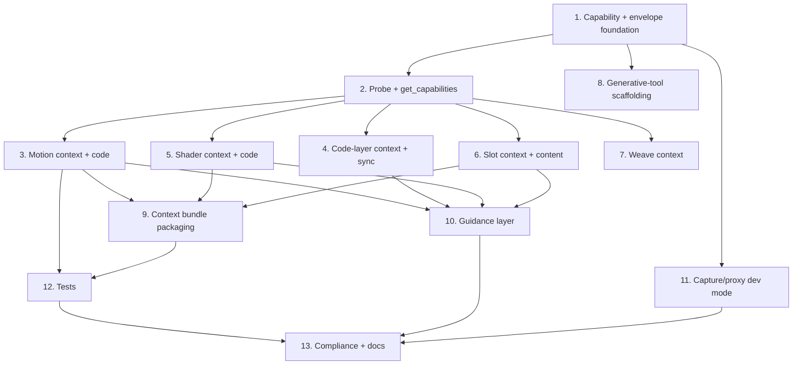

# Implementation Plan

## Overview

Additive implementation of the Config 2026 MCP expansion. Work proceeds foundation-first (capability envelope + probe), then one vertical slice per capability (motion, code layers, shaders, slots, weave), then cross-cutting deliverables (bundle, guidance layer, capture/proxy), followed by tests and compliance. Pure server-side transforms are built test-first with `fast-check`; plugin-sandbox readers are covered by the capability envelope and manual smoke tests.

## Tasks

- [x] 1. Add shared capability + envelope foundation (server)
  - Create `mcp-server/src/capabilities.js` with `normalizeCapabilities(raw)` (fills every leaf with `false`, stamps `probedAt`, idempotent) and a server-side TTL cache `get({ refresh, sendToFigma })` that probes via `{ type: "get_capabilities" }`.
  - Add an `envelope`/result helper (or extend `content.js`) for the uniform `{ ok, supported, degraded, reason }` shape used by tools.
  - _Requirements: 1.1, 1.2, 1.3, 1.4, 1.5, 1.6_

- [x] 2. Probe + expose capabilities (plugin + tool)
  - [x] 2.1 Add `detectCapabilities()` and a `probe(fn)` guard in `figma-plugin/code.js`; add the `case "get_capabilities"` handler returning apiVersion/editorType/capabilities/probedAt.
    - _Requirements: 1.1, 1.2_
  - [x] 2.2 Register the `get_capabilities` MCP tool in `mcp-server/src/tools.js` (wired through the capabilities cache), returning JSON.
    - _Requirements: 1.3, 1.6_

- [ ] 3. Motion context + code emission
  - [x] 3.1 Implement `getMotionContext(node)` in `figma-plugin/code.js` (preset styles + manual keyframe tracks + derived duration + reactions fallback); add `case "get_motion_context"`.
    - _Requirements: 2.1, 2.2, 2.3, 2.4, 1.4_
  - [x] 3.2 Create pure `mcp-server/src/generators/motion.js` (`emitMotionCode` + css/json/react): deterministic, total, empty-safe, format/language agreement.
    - _Requirements: 2.5, 2.6, 2.7, 2.8, 2.9, 2.10_
  - [x] 3.3 Register `get_motion_context` and `export_motion_code` tools in `tools.js`.
    - _Requirements: 2.1, 2.5, 2.10_

- [ ] 4. Code-layer context + sync
  - Implement `getCodeLayerContext` (API path + `pluginData` fallback with `metadataSource`) and `syncCodeLayer` (explicit `direction`, returns `mutatedNodeIds`) handlers in `code.js`; register `get_code_layer_context` and `sync_code_layer` tools.
  - _Requirements: 3.1, 3.2, 3.3, 3.4_

- [ ] 5. Shader context + code emission
  - [x] 5.1 Implemented `getShaderContext` (reads `SHADER`-type fills + `listAvailableShaders`, honest `degraded` when none) in `code.js`; registered `get_shader_context` tool; verified live. Discovered model: shaders are `type:"SHADER"` paints referencing a shader `id`.
    - _Requirements: 4.1, 4.2_
  - [~] 5.2 `export_shader_code` NOT built: the Plugin API does not expose shader GLSL source (shaders are referenced by id only), so code emission isn't possible. Authored `skills/figma-shaders/SKILL.md` documenting inspect + apply-by-id instead.
    - _Requirements: 4.3 (re-scoped: source not available)_

- [x] 6. Slot context + content
  - Implemented `getSlotContext` (finds SLOT-typed nodes) and `setSlotContent` (text child or move-existing-node, returns mutatedNodeIds) in `code.js`; registered `get_slot_context` and `set_slot_content` tools. Verified live end-to-end (Card component + Body slot, read empty -> fill -> read populated).
  - _Requirements: 5.1, 5.2, 5.3_

- [ ] 7. Weave context
  - Implement `getWeaveContext` (graph nodes/edges/params → section/connector fallback with `degraded` + warning) in `code.js`; register `get_weave_context` tool.
  - _Requirements: 6.1, 6.2_

- [ ] 8. Generative-tool scaffolding (server-only)
  - Create `mcp-server/src/generators/scaffold.js` (`scaffoldGenerativeTool` validates spec, emits parameterized `use_figma` script + JSON descriptor, warnings on gaps, no auto-exec); register `scaffold_generative_tool` tool.
  - _Requirements: 7.1, 7.2, 7.3_

- [ ] 9. Context bundle packaging
  - Implement `package_context_bundle` in `tools.js` orchestrating existing + new readers, capability-gated (omit unavailable parts, preserve `degraded`/`reason`, never fabricate).
  - _Requirements: 8.1, 8.2, 8.3_

- [x] 10. Guidance layer (skills + steering + MCP prompts/resources)
  - [x] 10.1 Author companion docs mirroring the existing pattern: `skills/figma-motion/SKILL.md`, `skills/figma-slots/SKILL.md`, and `powers/local-figma/steering/config-2026.md` (when/order/chaining/degraded handling; paraphrased with compliance note). Code-layers/shaders skills deferred until those features are built.
    - _Requirements: 9.1, 9.4_
  - [x] 10.2 `mcp-server/src/guidance.js` registers MCP `prompts` (skills) and `resources` (steering) loaded from disk; wired into `server.js` (boots "11 skills, 6 steering docs"). Unit-tested.
    - _Requirements: 9.2, 9.3_

- [ ] 11. Official-MCP capture/proxy dev mode (dev-only)
  - Add `mcp-server/src/proxy-capture.js` and CLI/env wiring in `server.js`: off by default; with `--proxy`/`FIGMA_MCP_UPSTREAM`, connect as MCP client and enumerate upstream `tools/list`/`prompts/list`/`resources/list`; write read-only JSON to `.figma-mcp/capture/`; gitignore that path; no auto-rewrite, no project-code transmission.
  - _Requirements: 10.1, 10.2, 10.3, 10.4_

- [ ] 12. Tests
  - [ ] 12.1 Add `fast-check` (devDependency) and property tests under `mcp-server/test/`: capability totality/idempotence (P1, P2), motion generator totality/determinism/empty-safety/monotonicity/format-language (P3–P7), and degradation honesty via mocked node shims (P8).
    - _Requirements: 1.1, 1.2, 1.5, 2.4, 2.5, 2.6, 2.7, 2.8, 2.9_
  - [ ] 12.2 Add unit tests for `package_context_bundle` capability-gating with a mocked `sendToFigma` (P9).
    - _Requirements: 8.2, 8.3_

- [ ] 13. Compliance, scope, and docs
  - Verify no new ports/endpoints, no `eval` of returned source, all additions additive (no removed/renamed tools); add the hosted-agent out-of-scope + capture compliance notes to `README.md`/`SECURITY.md` and confirm `.gitignore` covers `.figma-mcp/capture/`.
  - _Requirements: 11.1, 11.2, 11.3, 11.4_

- [x] 14. API discovery pipeline (foundation for generating the feature tools)
  - [x] 14.1 Schema-by-error decoder: `mcp-server/src/schema-probe.js` (`parseValidationError`, `extractEnums`, `summarizeShape`) with tests against real captured Figma error strings.
    - _Requirements: 1.1, 1.2_
  - [x] 14.2 Deep API mapper + controlled prober in `figma-plugin/code.js` (`introspect_api` full enumeration; `probe_schema` with destructive-method denylist + throwaway nodes).
    - _Requirements: 1.1, 1.2_
  - [x] 14.3 Register `introspect_api` and `probe_schema` MCP tools (probe_schema decodes via schema-probe.js).
    - _Requirements: 1.3_
  - [x] 14.4 Seed `.figma-mcp/api-catalog.json` from verified live findings (motion presets + 30 animatable properties + keyframe contract, shaders, slots-on-component, reactions).
    - _Requirements: 1.1_
  - [x] 14.5 `build_api_catalog` tool: orchestrate introspect_api + a curated safe probe set, decode, and persist/refresh the catalog; diff across Figma versions. Pure assembler `buildCatalog` + `diffCatalogs` + file store, unit-tested; live sweep written to `.figma-mcp/api-catalog.json`.
    - _Requirements: 1.1, 1.3_

- [x] 15. Motion preset baking (capture Figma UI presets -> reusable presets)
  - [x] 15.1 Pure `mcp-server/src/generators/preset-bake.js` (`normalizeAnimations` resolves `node.animations` -> clean tracks: rounds float noise, drops no-op tracks, FLOAT/VECTOR aware, preserves CUSTOM_SPRING params; `makePreset`, `presetToApplyPayload`). Unit-tested (incl. spring regression).
  - [x] 15.2 `mcp-server/src/preset-store.js` file store + `motion-presets.json`.
  - [x] 15.3 Plugin handlers `bake_preset` (reads `node.animations`) and `apply_motion` (replays tracks via `applyManualKeyframeTrack`, sets `playbackSettings.loop` when looping).
  - [x] 15.4 Tools `bake_preset`, `list_motion_presets`, `apply_motion` (loop-aware) wired through the preset store.
  - [x] 15.5 Captured the full Figma Motion library via the UI-bake workflow: 36 presets across Enter (12), Cycle (12, looping), Exit (12) — verified consistent, spring/overshoot easings preserved.
  - _Rationale: Figma's UI authors named presets the API can't apply with custom values; baking captures them as replayable keyframe presets. Verified live._

- [x] 16. Scene replication (video -> spec -> rebuild)
  - [x] 16.1 Pure `mcp-server/src/generators/scene-replicate.js` (`convertScene`, `convertEasing`): spec -> element plan with startDelay offsets + hold keyframes, easing array/"spring" conversion, cycle->loop, preset-match substitution. Unit-tested.
  - [x] 16.2 Plugin `replicate_scene` handler builds elements + applies motion; `apply_motion`/`replicate_scene` extend node timelines via `setTimelineDuration(timelineId, seconds)` to cover the last keyframe (default is 2s — discovered via the error-leak technique).
  - [x] 16.3 Server `replicate_scene` tool wired through the preset store.
  - [x] 16.4 Verified live: replicated a real 47s, 12-element product reveal (Origami.chat) from a Grok-parsed spec — all elements + staggered motion, full timeline. See `MISC/video-replication/`.

## Task Dependency Graph



```json
{
  "waves": [
    { "wave": 1, "tasks": ["1"] },
    { "wave": 2, "tasks": ["2"] },
    { "wave": 3, "tasks": ["3", "4", "5", "6", "7", "8", "11"] },
    { "wave": 4, "tasks": ["9", "10"] },
    { "wave": 5, "tasks": ["12"] },
    { "wave": 6, "tasks": ["13"] }
  ]
}
```

## Notes

- Architecture invariant: every capability is `tools.js` (register) → `bridge.sendToFigma` → `code.js` `case` → Plugin API; pure transforms live in `mcp-server/src/generators/` and are unit/property-tested in Node.
- Tasks 3–7 are independent vertical slices and can be implemented in parallel once Task 2 lands; pick the order by API maturity (Slots/Motion are the most solid; code layers/shaders/weave are beta and rely on graceful degradation).
- Tasks 8, 10, and 11 require no Figma beta API and can proceed independently of the beta-gated slices.
- Do not remove or rename existing tools (Requirement 11.4). Capture/proxy mode stays off by default and must not transmit project code (Requirements 10.1, 10.4).
