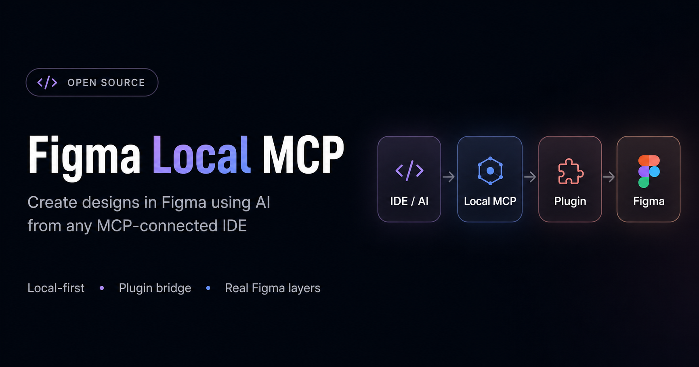

# Free Figma MCP

A free, local alternative to Figma's official MCP server — **no request rate limits**, and it works with **any** MCP client (Cursor, Claude Code, Codex, VS Code, Windsurf, Kiro, Qoder, terminal agents, …), not just one IDE.

It exposes official-style Figma tool names but routes every call through your **active Figma Desktop file** via a local plugin bridge, so there's no hosted quota wall and no vendor lock-in.

> Not affiliated with Figma. A local compatibility bridge inspired by the official Figma MCP workflow.

## Quick start

No clone needed:

```bash
npx -y -p free-figma-mcp free-figma-mcp-init
```

The setup picks your client, writes its MCP config (JSON, VS Code `servers`, or Codex TOML), optionally installs the bundled skills/rules, and copies the Figma plugin to your Downloads folder with import steps.

Then in Figma Desktop: `Plugins → Development → Import plugin from manifest` → pick the copied `manifest.json` → run **Free Figma MCP Bridge** → **Start**. Ask your agent to call `get_metadata` or `use_figma`.

Manual config (any client that takes a standard `mcpServers` block):

```json
{
  "mcpServers": {
    "free-figma-mcp": {
      "command": "npx",
      "args": ["-y", "free-figma-mcp"],
      "env": {}
    }
  }
}
```

## What you get

- Official-style tools: `use_figma`, `get_metadata`, `get_design_context`, `get_screenshot`, `get_variable_defs`, `search_design_system`, Code Connect mapping tools, `get_figjam`, `generate_diagram`, `create_new_file`, and more.
- Config 2026 surfaces: motion (timeline/keyframes/presets), slots, shaders, plus live API discovery.
- Bundled agent skills + a Kiro power so agents generate valid Figma scripts.

See **[docs/TOOLS.md](docs/TOOLS.md)** for exact behavior and **[docs/CLIENT_SETUP.md](docs/CLIENT_SETUP.md)** for the full per-client / per-OS setup matrix.

## How it works

```text
MCP client → local MCP stdio server → owner/relay bridge
  → ws://localhost:3055 → Figma plugin → Figma Plugin API → active Figma Desktop file
```

Multi-client aware: the first process owns the bridge on port `3055`; later clients relay through it.

## Limits

- Operates on the **active** Figma Desktop document; `fileKey` args are accepted but ignored (no remote file fetches).
- `use_figma` runs JavaScript in the Figma plugin sandbox — only connect agents you trust. See [SECURITY.md](SECURITY.md).
- Long scripts should cooperate with `mcp.throwIfStopped()` so the Stop button works.

Compatibility details: [docs/OFFICIAL_COMPATIBILITY.md](docs/OFFICIAL_COMPATIBILITY.md).

## Development

```bash
npm install
npm run validate   # check + plugin check + tests
```

`mcp-server/` (server, CLI, src, tests) · `figma-plugin/` (manifest, sandbox, UI) · `skills/` · `powers/` · `docs/`

## License

MIT. See [LICENSE](LICENSE).
